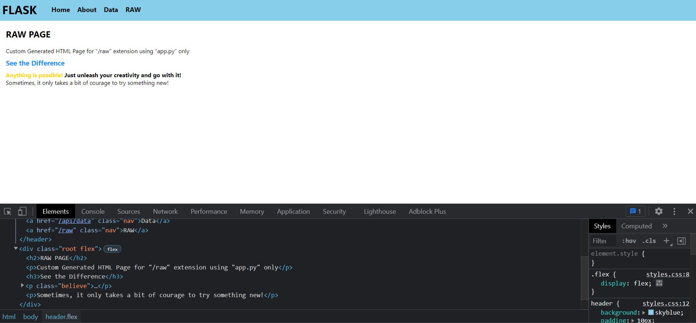
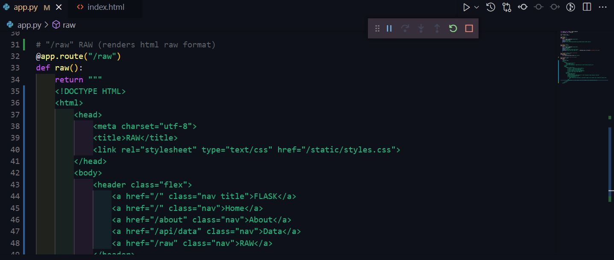

# Python-HTML
HTML webpage rendering using Python Flask

---

### Perhaps I've been fooling around for too long.

Time to move on, but feel free to play with this repository as you please if you are interested in furthering web development with Python. I'm just playing with some basic FLASK library modules here. :)

You can also "send_static_file" to directly retrieve JSON files via Python Webpage

